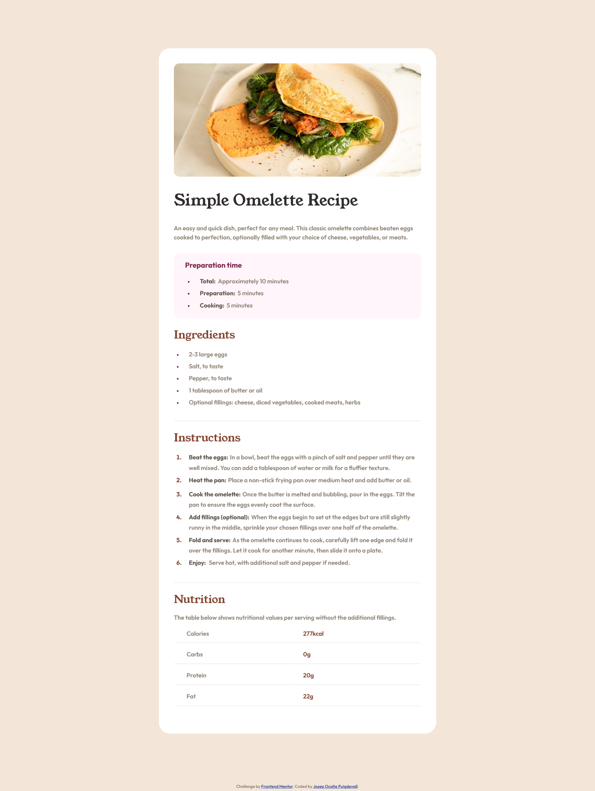

# Frontend Mentor - Recipe page solution

This is a solution to the [Recipe page challenge on Frontend Mentor](https://www.frontendmentor.io/challenges/recipe-page-KiTsR8QQKm). Frontend Mentor challenges help you improve your coding skills by building realistic projects.

## Table of contents

- [Overview](#overview)
  - [The challenge](#the-challenge)
  - [Screenshot](#screenshot)
  - [Links](#links)
- [My process](#my-process)
  - [Built with](#built-with)
  - [What I learned](#what-i-learned)
  - [Continued development](#continued-development)
  - [Useful resources](#useful-resources)
- [Author](#author)
- [Acknowledgments](#acknowledgments)

**Note: Delete this note and update the table of contents based on what sections you keep.**

## Overview

This is a FrontendMentor Challenge of a recipe Page

## The challenge

I tried to do this page as close as possible to the original, font sizes, margins, paddings.

### Screenshot



### Links

- Solution URL: [recipePage github project](https://github.com/Pepekid/frontendMentor-recipePage)
- Live Site URL: [recipePage](https://frontend-mentor-recipepage-pepekid.netlify.app/)

## My process

First, I looked the project and I organized how make different parts in html and made classes to do the code shorter. Then I wrote the HTML code and after this, I wrote the CSS following the steps that the exercise told us. with variables and fonts required for this project.

### Built with

- HTML: I tried to do a well organization putting each part of contents in sections named lile titles. I built the page with classes for ordered and unordered lists to make the css shorter and efficient. I created classes to do more efficient my code

- CSS: I organized my code first with fonts, variables, and presets: html, titles, sections, lists and markers and spans. After I organized my sections as well as possible.

- Mobile-first: I tried to make as shorter as possible, even so I had to touch some classes to make the styles as same as possible to mobile resize.

### What I learned

I learnt to organize my code I made useful classes in each label to do my css shorter.

```html
<section class="preparation">
  <h3>Preparation time</h3>
  <ul class="unordered">
    <li class="li-ul"><span>Total:</span> Approximately 10 minutes</li>
    <li class="li-ul"><span>Preparation:</span> 5 minutes</li>
    <li class="li-ul"><span>Cooking:</span> 5 minutes</li>
  </ul>
</section>
```

To make this code lighter and so write less code

```css
.unordered ::marker {
  color: var(--darkRaspberry);
  font-size: 13px;
}

.unordered li {
  padding-left: 1rem;
  line-height: 2rem;
}

span,
.ordered ::marker {
  font-weight: bold;
}
```

I also learnt how easy is to break a good style when you tried to do responsive pages so I will try to make code carefully.

### Continued development

Working with this project I realized that my html and Css need to improve to do pages more organized and putting labels correctly.I also realized that I need to learn more about responsive pages and how do more efficient code.

## Author

- Frontend Mentor - [@Pepekid](https://www.frontendmentor.io/profile/Pepekid)

## Acknowledgments

I want to thank the FrontendMentor team to encourage to make new projects and learn with them, and help me to improve my frontend skills.
