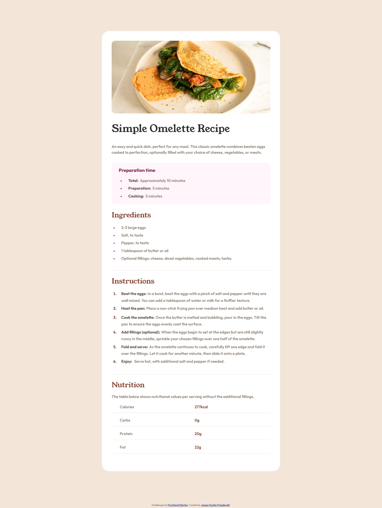
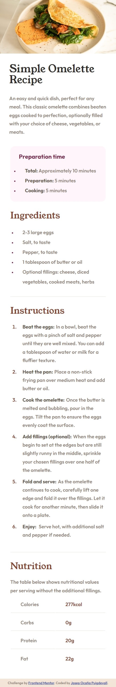

# Frontend Mentor - Recipe page solution

This is a solution to the [Recipe page challenge on Frontend Mentor](https://www.frontendmentor.io/challenges/recipe-page-KiTsR8QQKm). Frontend Mentor challenges help you improve your coding skills by building realistic projects.

## Table of contents

-   [Overview](#overview)
    -   [The challenge](#the-challenge)
    -   [Screenshot](#screenshot)
    -   [Links](#links)
-   [My process](#my-process)

    -   [Built with](#built-with)
    -   [What I learned](#what-i-learned)
    -   [Continued development](#continued-development)

-   [Author](#author)
-   [Acknowledgments](#acknowledgments)

## Overview

This is a FrontendMentor exercise of a recipe Page

## The challenge

The challenge is to do this page as close as possible to the exercise, font sizes, margins, paddings, colors...

### Screenshot desktop design



### Screenshot mobile design



### Links

-   Solution URL: [@pepekid_recipePage github project](https://github.com/Pepekid/frontendMentor-recipePage)
-   Live Site URL: [@pepekid_recipePage](https://frontend-mentor-recipepage-pepekid.netlify.app/)

## My process

First, I looked the project and I organized how make different parts in html and made classes to do the code shorter. Then I wrote the HTML code and after this, I wrote the CSS following the steps that the exercise told us. with variables and fonts required for this project.

### Built with

-   HTML: I tried to do a well organization putting each part of contents in sections with ids. After made classes for ordered and unordered lists, titles to make the css shorter and efficient.

-   CSS: I organized my code first with fonts, variables, and presets: html, h3 titles, sections, lists and markers and spans. After I organized my sections as well as possible.

-   Mobile-first: I tried to make as shorter as possible, even so I had to touch some classes to make the styles as same as possible to mobile resize.

### What I learned

I learnt to organize my code I made useful classes in each label to do my code more efficient.

```html
<section id="ingredients">
	<h2 class="title">Ingredients</h2>
	<ul>
		<li class="li-ul">2-3 large eggs</li>
		<li class="li-ul">Salt, to taste</li>
		<li class="li-ul">Pepper, to taste</li>
		<li class="li-ul">1 tablespoon of butter or oil</li>
		<li class="li-ul">
			Optional fillings: cheese, diced vegetables, cooked meats, herbs
		</li>
	</ul>
</section>
```

To make this code lighter and so write less code:

```css
.title {
	color: var(--nutmeg);
	font-family: var(--font-Young-serif);
	font-weight: lighter;
	font-size: 1.8rem;
	margin-bottom: 1.5rem;
}

section {
	margin-bottom: 2rem;
	background: var(--white);
}

ul ::marker {
	color: var(--darkRaspberry);
	font-size: 13px;
}
```

I also learnt how easy is to break a good style when you tried to do responsive pages so I will try to make code carefully.

### Continued development

Working with this project I realized that my html and Css need to improve to do pages more organized and putting labels correctly. I also realized that I need to learn more about responsive pages and how do more efficient code.

## Author

-   Frontend Mentor - [@Pepekid](https://www.frontendmentor.io/profile/Pepekid)

## Acknowledgments

I want to thank the FrontendMentor team for making such useful content for people who want to improve and learn how to do projects to be well trained in the future.
